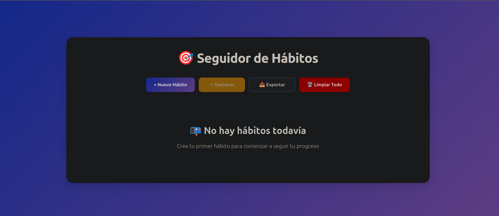
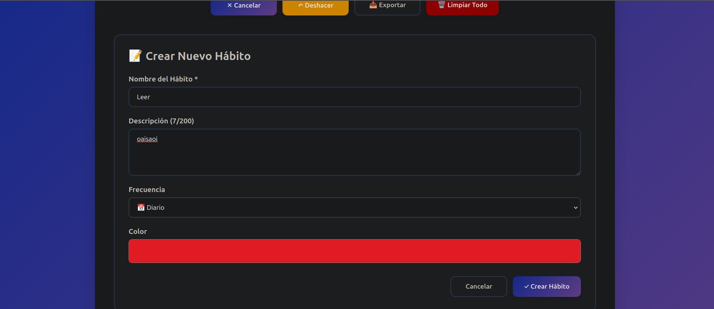
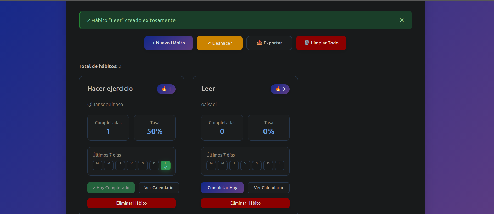

This is the final readme needed for the submission. The readme on the main folder has the instructions to launch the application.

https://github.com/ErikLahuerta/Lab6_Seguiment-habits

# Prompts

## Prompt 1
Crea una aplicación React de seguimiento de hábitos basada en estas user stories:

US-01: Como usuario, quiero definir hábitos personales para llevar el control de mis rutinas.
US-02: Como usuario, quiero marcar hábitos como completados para saber si he seguido mis objetivos.
US-03: Como usuario, quiero ver un calendario de cumplimiento para visualizar mi progreso.
US-04: Como usuario, quiero eliminar hábitos antiguos para mantener solo los relevantes.

Criterios de aceptación:
- Todas las funcionalidades deben estar disponibles en la interfaz principal.
- El usuario debe poder deshacer acciones cuando sea necesario.
- El sistema debe mostrar un mensaje de confirmación después de cada acción.
- Los datos deben guardarse correctamente y ser accesibles posteriormente.

Implementa una app sencilla y clara para un proyecto académico. Usa localStorage para guardar los hábitos y sus fechas de cumplimiento.

## Prompt 2
Revisa el código actual y corrige lo necesario para que la app cumpla todos estos puntos:

- Crear hábitos personales.
- Marcar hábitos como completados.
- No permitir marcar el mismo hábito dos veces el mismo día.
- Mostrar un calendario o progreso de los últimos 7 días.
- Eliminar hábitos antiguos.
- Mostrar mensajes de confirmación al crear, completar o eliminar.
- Permitir deshacer la última acción importante, especialmente completar o eliminar.
- Guardar todo correctamente en localStorage.

Además, mejora el diseño visual de la aplicación sin cambiar la lógica principal.

Quiero:
- Interfaz limpia y clara.
- Formulario visible para crear hábitos.
- Hábitos mostrados en tarjetas.
- Botones claros para completar, eliminar y deshacer.
- Mensajes de confirmación visibles.
- Calendario de cumplimiento de los últimos 7 días.
- Diseño responsive para móvil y ordenador.
- CSS sencillo y organizado.

# Screenshots of the final product
Main screen of the application

Create a new Habit

Displaying all created Habits

# Reflections on Copilot
Durant el desenvolupament de l’aplicació hem utilitzat GitHub Copilot com a eina de suport per crear una aplicació en React basada en les user stories del seguiment d’hàbits: afegir hàbits, marcar-los com completats, veure el progrés i eliminar hàbits antics.

Copilot ens ha ajudat sobretot a generar l’estructura inicial del projecte, crear components i afegir funcionalitats com el formulari d’hàbits, la llista, el calendari i la persistència de dades amb localStorage. També ens ha facilitat afegir missatges de confirmació i opcions per desfer accions.

Tot i això, hem vist que era necessari donar-li prompts clars i concrets, ja que amb instruccions massa generals no sempre generava exactament el que necessitàvem. Per això hem anat refinant els prompts i revisant el codi abans d’acceptar-lo.

En conclusió, Copilot ens ha permès avançar més ràpidament, però sempre hem hagut de revisar, provar i adaptar el codi per assegurar-nos que complia els requisits de l’activitat.